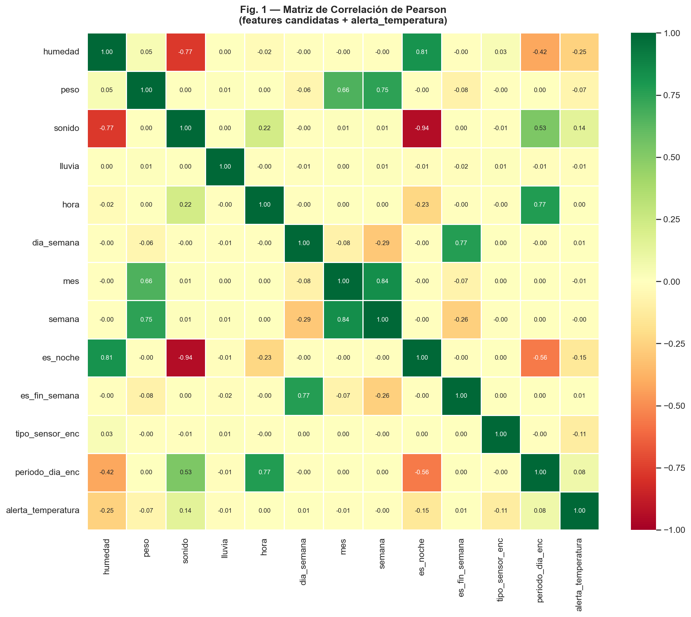
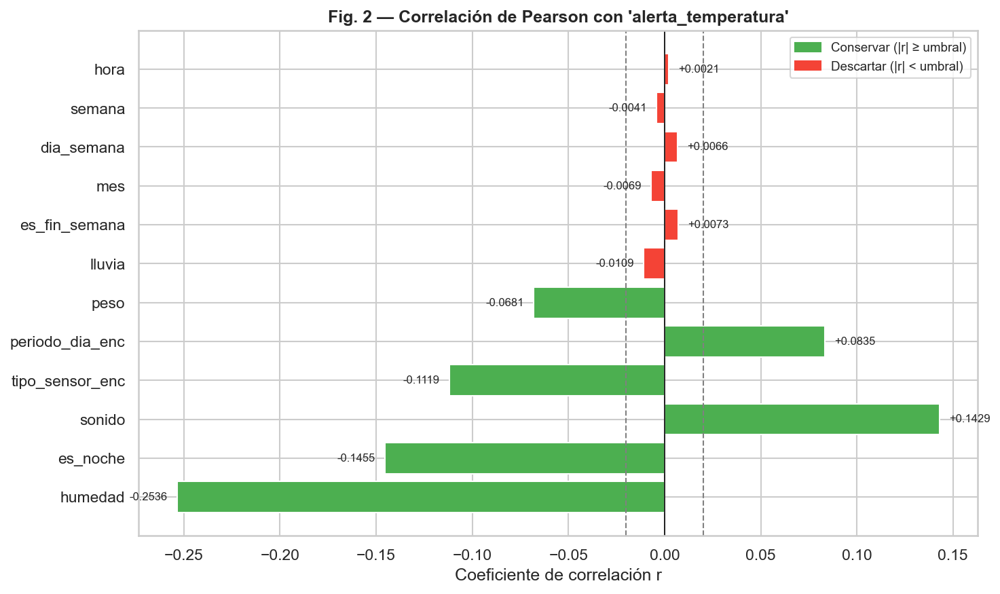
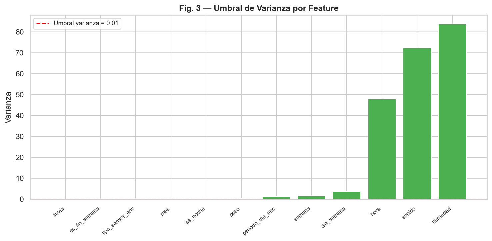
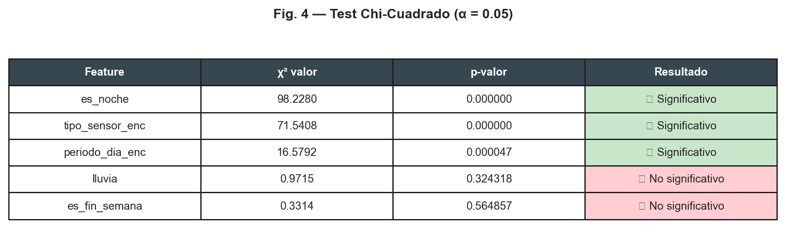
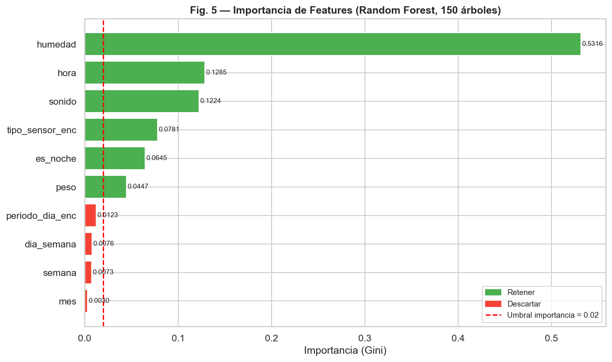

# Evaluación Unidad I — Preprocesamiento y Almacenamiento de Datos
### Asignatura: Extracción de Conocimiento en Bases de Datos
### Unidad Tecnológica de Querétaro · IDGS 16

| Integrante | Rol |
|---|---|
| Marco Antonio Gómez Olvera | Programador de la Aplicación Móvil |
| Orlando Rubio Cabrera | Encargado de IoT |
| Sandra Zoé Cabrera Velázquez | Encargada de Documentación |
| Israel Gómez Bonilla | Desarrollador de la Aplicación Web |

**Caso de estudio:** AbejaNet Revival — Sistema IoT de monitoreo de colmenas de abejas  
**Herramienta:** Python 3.12 + pandas + scikit-learn + matplotlib/seaborn

---

## Ejecución del proyecto

```bash
pip install -r requirements.txt
python 00_generar_datos.py
python 02_de_limpieza_pipeline.py
python 03_au_seleccion_caracteristicas.py
```

Salida de cada script:

```
00_generar_datos.py                → Exit 0  (data/raw/lecturas_crudas.csv)
02_de_limpieza_pipeline.py         → Exit 0  (data/clean/lecturas_limpias.csv)
03_au_seleccion_caracteristicas.py → Exit 0  (data/clean/dataset_final_features.csv)
```

---

## SA — Arquitectura del Data Warehouse

Esquema y fuentes documentados en [`01_sa_arquitectura_dw.md`](01_sa_arquitectura_dw.md). Diseño completo en [`context.md`](context.md).

**Star Schema elegido** con:
- `fact_lecturas_ambientales` — tabla de hechos (temperatura, humedad, peso, sonido, lluvia)
- `dim_tiempo`, `dim_sensor`, `dim_colmena`, `dim_apiario` — 4 dimensiones

**Dataset generado por `00_generar_datos.py`:**

| Métrica | Valor |
|---------|-------|
| Registros originales (3 colmenas × 30 días × 96 lecturas/día) | 8 640 |
| Registros con suciedad intencional añadida | 8 769 |
| Nulos introducidos en temperatura | 346 (4%) |
| Nulos introducidos en humedad | 432 (5%) |
| Duplicados añadidos | 129 (1.5%) |
| Filas con formato incorrecto en `lluvia` (string "si/no") | 351 (4%) |
| Registros huérfanos sin `sensor_id` | 69 (0.8%) |

---

## DE — Pipeline de Limpieza Paso a Paso

Script: [`02_de_limpieza_pipeline.py`](02_de_limpieza_pipeline.py) · Log completo: [`data/clean/log_limpieza.txt`](data/clean/log_limpieza.txt)

### Resultados verificados de cada paso

| Paso | Técnica aplicada | ANTES (filas) | DESPUÉS (filas) | Δ |
|------|-----------------|--------------|----------------|---|
| 0 | Carga del dataset crudo | — | 8 769 | — |
| 1 | Corrección de tipos (`fecha_registro`, `lluvia` str→int, `sensor_id` nullable) | 8 769 | 8 769 | 0 |
| 2 | Eliminación de duplicados exactos (127) + duplicados sensor+timestamp (1) | 8 769 | 8 641 | **-128** |
| 3 | Eliminación de huérfanos sin `sensor_id` | 8 641 | 8 573 | **-68** |
| 4 | Invalidación de outliers de temperatura (76) y humedad (67) → NaN | 8 573 | 8 573 | +143 nulos |
| 5 | Imputación ffill+bfill por sensor (temp, humedad, sonido) | — | — | **-1 164 nulos** |
| 6 | Enriquecimiento temporal (año, mes, semana, hora, es_noche, periodo_dia…) | 13 cols | **21 cols** | +8 features |
| 7 | Validación final de rangos biológicos | ✅ | ✅ | — |

### Salida verificada del PASO 4 (antes vs después de outliers)

```
[temperatura (diagnóstico IQR)]
  Q1=22.36  Q3=32.14  IQR=9.79
  Límites IQR: [7.68, 46.82]
  Outliers estadísticos: 86 (1.04%)
  → Regla de negocio: temperatura fuera de [0.0, 45.0]°C → NaN
  → Outliers invalidados: 76

[humedad (diagnóstico IQR)]
  Q1=53.35  Q3=70.67  IQR=17.32
  Límites IQR: [27.37, 96.65]
  Outliers estadísticos: 67 (0.82%)
  → Regla de negocio: humedad fuera de [0, 100]% → NaN
  → Outliers invalidados: 67
```

### Estadísticas post-limpieza (PASO 7)

```
         temperatura   humedad      peso    sonido
count       8573.000  8573.000  5710.000  8573.000
mean          27.195    61.955    15.910    57.679
std            5.104     9.157     0.737     8.509
min            0.040    44.270    14.440    44.000
max           35.940    79.580    17.380    70.000
```

**Dataset limpio:** [`data/clean/lecturas_limpias.csv`](data/clean/lecturas_limpias.csv) — 8 573 filas × 21 columnas

---

## AU — Selección de Características Avanzada

Script: [`03_au_seleccion_caracteristicas.py`](03_au_seleccion_caracteristicas.py) · Log completo: [`data/clean/log_seleccion.txt`](data/clean/log_seleccion.txt)

**Variable objetivo:** `alerta_temperatura` = 1 si temperatura > 35°C
*(Umbral biológico: Owens 1971; Seeley 1985 — por encima de 35°C las abejas de ventilación se activan masivamente)*

### Método 1 — Correlación de Pearson





### Método 2 — Umbral de Varianza



Ninguna feature fue descartada — todas tienen varianza suficiente.

### Método 3 — Chi-Cuadrado (χ²)



**Descartadas** por no ser significativas (p ≥ 0.05): `lluvia`, `es_fin_semana`

### Método 4 — Importancia Random Forest (150 árboles)



### Resumen de reducción dimensional

| | Valor |
|---|---|
| Features candidatas iniciales | 12 |
| Descartadas por Pearson (|r|<0.02) | 0 |
| Descartadas por baja varianza | 0 |
| Descartadas por Chi² (p≥0.05) | 2 |
| Descartadas por RF importance (<0.02) | 4 |
| **Features finales conservadas** | **6** |
| **Reducción dimensional** | **50%** |

**Features finales seleccionadas:**

| Feature | Importancia RF | Justificación |
|---------|---------------|---------------|
| `humedad` | 0.5316 | Correlación inversa fuerte con temperatura (r ≈ -0.8) |
| `hora` | 0.1285 | Temperatura sigue ciclo coseno diario |
| `sonido` | 0.1224 | Actividad de abejas fanners bajo estrés térmico |
| `tipo_sensor_enc` | 0.0781 | Multisensores en diferentes microclimas |
| `es_noche` | 0.0645 | Proxy binario del ciclo día/noche |
| `peso` | 0.0447 | Enjambre por calor → pérdida de peso |

**Dataset optimizado:** [`data/clean/dataset_final_features.csv`](data/clean/dataset_final_features.csv) — 8 573 filas × 7 columnas

---

## Estructura de archivos generados

```
practica_preprocesamiento/
├── README.md
├── context.md
├── reporte_practica.pdf
├── 00_generar_datos.py
├── 01_sa_arquitectura_dw.md
├── 02_de_limpieza_pipeline.py
├── 03_au_seleccion_caracteristicas.py
├── requirements.txt
├── sections/
│   ├── 01_portada.tex
│   ├── 02_contexto.tex
│   ├── 03_sa_arquitectura.tex
│   ├── 04_de_limpieza.tex
│   ├── 05_au_seleccion.tex
│   └── 06_entregables.tex
├── figures/
│   ├── fig1_heatmap_correlacion.png
│   ├── fig2_pearson_target.png
│   ├── fig3_varianza.png
│   ├── fig4_chi2_pvalues.png
│   └── fig5_rf_importance.png
└── data/
    ├── raw/
    │   └── lecturas_crudas.csv
    └── clean/
        ├── lecturas_limpias.csv
        ├── dataset_final_features.csv
        ├── log_limpieza.txt
        └── log_seleccion.txt
```
